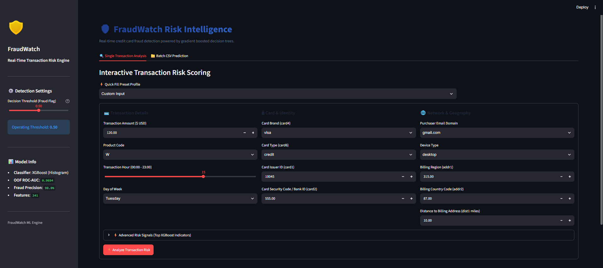
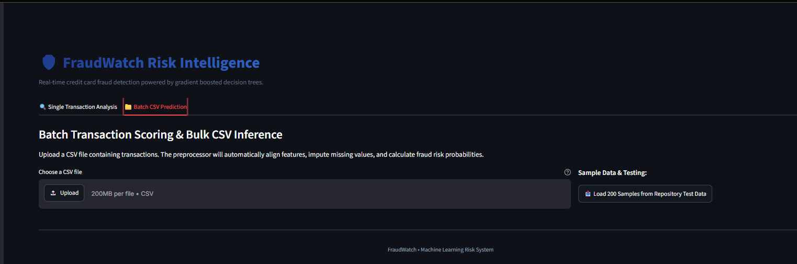
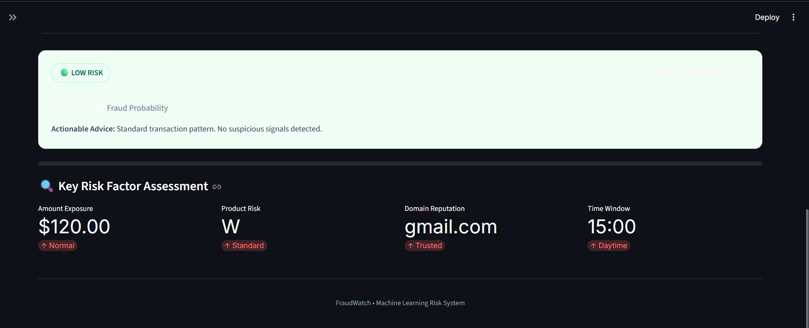

# FraudWatch

FraudWatch is a machine learning project for detecting fraudulent transactions using the IEEE-CIS Fraud Detection dataset.

The project processes transaction and identity data, handles severe class imbalance, engineers features, compares LightGBM and XGBoost using 5-fold stratified cross-validation, and provides predictions through a Streamlit web application.

XGBoost was selected as the final model based on its validation performance.

## Features

- Fraud detection using transaction and identity data
- Data preprocessing and feature engineering
- Handling severe class imbalance with `scale_pos_weight`
- Target encoding and frequency encoding
- LightGBM baseline model
- XGBoost final model
- 5-fold stratified cross-validation
- Out-of-fold model evaluation
- Single transaction fraud prediction
- Batch CSV fraud prediction
- Adjustable decision threshold
- CSV export of prediction results

## Screenshots

| Dashboard | Dashboard | Transaction Analysis |
| :---: | :---: | :---: |
|  |  |  |

## Dataset

The project uses the IEEE-CIS Fraud Detection dataset.

| Dataset | Records |
|---|---:|
| Training transactions | 590,540 |
| Training identity records | 144,233 |
| Fraud transactions | 20,663 |
| Fraud rate | 3.499% |

Transaction and identity data are merged using `TransactionID`.

The dataset is highly imbalanced, with approximately 27.58 legitimate transactions for every fraudulent transaction. This imbalance is handled using:

```python
scale_pos_weight = 27.58
```

## Data Processing

The preprocessing pipeline includes:

- Merging transaction and identity datasets using `TransactionID`
- Dropping features with more than 80% missing values
- Removing constant features
- Handling missing values
- Extracting time-based features from `TransactionDT`
- Applying `log1p` transformation to `TransactionAmt`
- Target encoding selected categorical features
- Frequency encoding categorical features
- Aligning processed data with the final model feature list

The final model uses **341 processed features**.

## Machine Learning Pipeline

```text
Raw Transaction Data + Identity Data
                |
                v
Merge on TransactionID
                |
                v
Data Cleaning
High-Missing and Constant Feature Removal
                |
                v
Feature Engineering
Time Features + Transaction Amount Transformation
                |
                v
Target Encoding + Frequency Encoding
                |
                v
341 Final Features
                |
                v
5-Fold Stratified Cross-Validation
                |
        -----------------
        |               |
        v               v
    LightGBM         XGBoost
        |               |
        -----------------
                |
                v
         XGBoost Selected
                |
                v
      Full Dataset Retraining
                |
                v
       Streamlit Application
```

## Models

### LightGBM Baseline

LightGBM was used as the baseline model and evaluated using 5-fold stratified cross-validation.

| Metric | Result |
|---|---:|
| OOF ROC-AUC | `0.964013` |
| Fraud Precision | `0.69` |
| Fraud Recall | `0.75` |
| F1-score | `0.72` |

### XGBoost Final Model

XGBoost was selected as the final model.

The model uses:

- `tree_method="hist"`
- `scale_pos_weight=27.58`
- 5-fold stratified cross-validation
- Early stopping during cross-validation

After cross-validation, the final model was retrained on the full training dataset using the mean best iteration count from the validation folds.

## Final Model Results

| Metric | XGBoost |
|---|---:|
| OOF ROC-AUC | `0.969376` |
| Fraud Precision | `0.90` |
| Fraud Recall | `0.72` |
| F1-score | `0.80` |
| Accuracy | `0.99` |

### Fold-wise ROC-AUC

| Fold | ROC-AUC |
|---|---:|
| Fold 1 | `0.967716` |
| Fold 2 | `0.968669` |
| Fold 3 | `0.968558` |
| Fold 4 | `0.971080` |
| Fold 5 | `0.970959` |
| Mean ± Std | `0.9694 ± 0.0014` |

## Model Comparison

| Model | OOF ROC-AUC | Precision | Recall | F1-score |
|---|---:|---:|---:|---:|
| LightGBM | `0.964013` | `0.69` | `0.75` | `0.72` |
| XGBoost | `0.969376` | `0.90` | `0.72` | `0.80` |

XGBoost achieved the higher OOF ROC-AUC and fraud precision, so it was selected as the final model.

## Feature Engineering

Key feature engineering steps include:

- Extracting transaction hour from `TransactionDT`
- Extracting transaction weekday from `TransactionDT`
- Applying `log1p` transformation to `TransactionAmt`
- Smoothed target encoding for selected categorical features
- Frequency encoding for categorical features
- Filling missing numeric values with `-999`
- Aligning incoming data with the trained model feature list

For unseen categorical values during inference:

- Target encoding falls back to the global fraud rate
- Frequency encoding falls back to `0`

## Streamlit Application

FraudWatch includes a Streamlit application for fraud prediction.

### Single Transaction Analysis

Users can enter transaction information and receive a fraud probability prediction.

The application supports transaction-related inputs including:

- Transaction amount
- Product code
- Card information
- Email domain
- Device type
- Billing information
- Transaction time
- Selected transaction features

### Batch Prediction

The application also supports batch fraud prediction using CSV files.

Features include:

- CSV upload
- Batch fraud scoring
- Adjustable decision threshold
- Risk categorization
- Exporting scored predictions to CSV

## Risk Classification

Predicted fraud probabilities are grouped into risk levels:

- **Low Risk:** Probability below `0.20`
- **Medium Risk:** Probability from `0.20` to the selected threshold
- **High Risk:** Probability greater than or equal to the selected threshold

The default decision threshold is `0.50`.

## Project Structure

```text
FraudWatch/
├── data/
│   ├── info.txt
│   ├── train_transaction.csv
│   ├── train_identity.csv
│   ├── test_transaction.csv
│   ├── test_identity.csv
│   ├── train_merged_clean.csv
│   ├── test_merged_clean.csv
│   ├── train_final_processed.csv
│   ├── test_final_processed.csv
│   └── sample_submission.csv
├── models/
│   ├── preprocessing_bundle.pkl
│   ├── lgbm_baseline_model.pkl
│   └── xgb_final_model.pkl
├── notebooks/
│   ├── 01_data_preprocessing.ipynb
│   ├── 02_EDA.ipynb
│   ├── 03_feature_engineering.ipynb
│   ├── 04_model_training_lightgbm.ipynb
│   └── 05_model_training_xgboost.ipynb
├── screenshots/
│   ├── home.png
│   ├── home2.png
│   └── analyze.png
├── app.py
├── requirements.txt
├── .gitignore
└── README.md
```

> **Note:** Large datasets and trained model files are kept locally and are not included in the GitHub repository due to file size.

## Installation

### 1. Clone the repository

```bash
git clone https://github.com/ashok-shetti/fraudwatch.git
cd fraudwatch
```

### 2. Create a virtual environment

```bash
python -m venv venv
```

Activate it on Windows:

```bash
venv\Scripts\activate
```

Activate it on Linux or macOS:

```bash
source venv/bin/activate
```

### 3. Install dependencies

```bash
pip install -r requirements.txt
```

### 4. Run the application

```bash
streamlit run app.py
```

The application will be available at:

```text
http://localhost:8501
```

## Tech Stack
| Area | Technologies |
|---|---|
| Programming | Python |
| Machine Learning | XGBoost, LightGBM, Scikit-learn |
| Data Processing | Pandas, NumPy, SciPy |
| Visualization | Matplotlib, Seaborn |
| Application | Streamlit |

## Limitations

- The project uses the IEEE-CIS benchmark dataset and may not represent every real-world fraud environment.
- The application does not include real-time streaming systems.
- Architecture is optimized for local demonstration via Streamlit rather than containerized microservice deployment (Docker/FastAPI).
- Automated model monitoring and drift detection are not included.
- Unseen categorical values fall back to predefined encoding defaults.
- The Streamlit application is designed as a project dashboard rather than a high-concurrency API service.